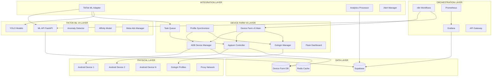

# 🚀 DEVICE FARM V5 + TIKTOK ML V4 - ANÁLISIS COMPLETO DEL FLUJO DE DATOS

## 📊 ARQUITECTURA INTEGRADA



## 🔄 FLUJO DE DATOS PRINCIPAL

### 1. **DEVICE INITIALIZATION FLOW**
```
┌─ Device Discovery ─┐    ┌─ Profile Assignment ─┐    ┌─ Sync Validation ─┐
│ ADB Scan Devices   │ -> │ Gologin API Query    │ -> │ Proxy Config Test  │
│ • Serial Detection │    │ • Profile Selection  │    │ • Connectivity OK  │
│ • Status Check     │    │ • Proxy Extraction  │    │ • Device Ready     │
└────────────────────┘    └──────────────────────┘    └────────────────────┘
```

### 2. **TASK EXECUTION FLOW**
```
┌─ ML Guidance ─┐    ┌─ Task Queue ─┐    ┌─ Device Execution ─┐    ┌─ Analytics ─┐
│ Risk Analysis │ -> │ Priority     │ -> │ Appium Session    │ -> │ Supabase   │
│ Behavior      │    │ Assignment   │    │ TikTok Automation │    │ Metrics    │
│ Timing        │    │ Device Lock  │    │ Screenshot ML     │    │ Alerts     │
└───────────────┘    └──────────────┘    └───────────────────┘    └────────────┘
```

### 3. **MONITORING & ALERTING FLOW**
```
┌─ Real-time Metrics ─┐    ┌─ Anomaly Detection ─┐    ┌─ Alert Processing ─┐
│ Device Health       │ -> │ ML Analysis         │ -> │ Discord/Slack      │
│ Task Performance    │    │ Pattern Recognition │    │ Email Notifications│
│ Proxy Status        │    │ Shadowban Detection │    │ Dashboard Updates  │
└─────────────────────┘    └─────────────────────┘    └────────────────────┘
```

## 📈 ANÁLISIS DE DATOS POR COMPONENTE

### **DEVICE FARM V5 DATA SOURCES**
```yaml
ADB Device Manager:
  inputs:
    - USB device connections
    - ADB command responses
    - Device status polling
  outputs:
    - Device inventory (SQLite)
    - Health metrics (Prometheus)
    - Proxy configurations
    - Screenshot captures
  
Gologin Manager:
  inputs:
    - Gologin API responses
    - Profile configurations
    - Proxy assignments
  outputs:
    - Profile database (SQLite)
    - Proxy mappings
    - Usage statistics
    - Cache data (Redis)

Task Queue:
  inputs:
    - Automation requests
    - ML guidance data
    - Device availability
  outputs:
    - Task execution logs
    - Performance metrics
    - Success/failure rates
    - Device utilization stats
```

### **TIKTOK ML V4 DATA INTEGRATION**
```yaml
ML Analysis Engine:
  inputs:
    - Device screenshots
    - Engagement data
    - Historical patterns
  outputs:
    - Risk scores
    - Optimal timing
    - Behavior recommendations
    - Anomaly flags

Analytics Processor:
  inputs:
    - Device Farm metrics
    - ML predictions
    - Task results
  outputs:
    - Unified dashboards
    - Performance reports
    - Trend analysis
    - Alert triggers
```

## 🎯 UNIFIED DATA MODEL

### **CORE ENTITIES**
```sql
-- Device Farm v5 Tables
devices (serial, status, model, assigned_profile, proxy_config)
gologin_profiles (id, name, proxy_host, proxy_port, status)
tasks (id, type, device_serial, parameters, status, result)

-- TikTok ML v4 Integration Tables (Supabase)
engagement_sessions (device_id, profile_id, actions, ml_guidance)
ml_predictions (timestamp, model_type, input_data, prediction, confidence)
anomaly_detections (device_id, timestamp, anomaly_type, score, actions_taken)
performance_metrics (timestamp, component, metric_name, value, tags)
```

### **DATA RELATIONSHIPS**
```
Device 1:N Tasks
Device 1:1 GologinProfile
Task 1:N MLPredictions  
Task 1:N EngagementSessions
Device 1:N AnomalyDetections
```

## 🔧 OPERATIONAL DATA FLOWS

### **REAL-TIME MONITORING**
```
Every 30s: Device Status → ADB Manager → SQLite → Dashboard
Every 60s: Health Metrics → Prometheus → Grafana → Alerts
Every 300s: Profile Sync → Gologin API → Redis Cache → Database
```

### **ML INTEGRATION PIPELINE**
```
Screenshot Capture → YOLO Analysis → Anomaly Detection → Risk Scoring → Action Decision
Device Behavior → Pattern Recognition → Guidance Generation → Task Modification
```

### **ANALYTICS AGGREGATION**
```
Raw Events → Analytics Processor → Supabase → Grafana Dashboards
Task Results → Performance Calculator → Trend Analysis → Optimization Recommendations
```

## 📊 PERFORMANCE METRICS

### **DEVICE FARM V5 KPIs**
- **Device Utilization**: Active devices / Total devices
- **Task Success Rate**: Completed tasks / Total tasks
- **Profile Sync Health**: Synced profiles / Total profiles  
- **Average Task Duration**: Mean execution time per task type
- **Proxy Connectivity**: Successful connections / Total attempts

### **INTEGRATION KPIs** 
- **ML Guidance Accuracy**: Successful predictions / Total predictions
- **Anomaly Detection Rate**: True positives / Total detections
- **End-to-End Latency**: Request to completion time
- **Data Pipeline Health**: Successful data flows / Total flows
- **Alert Response Time**: Detection to notification time

## 🚨 ALERTING & MONITORING

### **CRITICAL ALERTS**
```yaml
Device Offline:
  condition: device_status != 'online' for > 5min
  channels: [discord, dashboard]
  severity: high

Anomaly Detected:
  condition: anomaly_score > 0.8
  channels: [discord, email, dashboard] 
  severity: critical

Task Failure Rate:
  condition: failed_tasks > 30% in 1h
  channels: [discord, dashboard]
  severity: medium

Proxy Connection Failed:
  condition: proxy_test_failures > 5 in 10min
  channels: [discord, dashboard]
  severity: high
```

### **DASHBOARD VIEWS**
- **Executive Summary**: High-level KPIs and system health
- **Device Management**: Device status, assignments, health
- **Task Monitoring**: Queue status, execution logs, performance
- **ML Analytics**: Prediction accuracy, model performance  
- **System Health**: Infrastructure metrics, alerts, logs

## 🔄 DATA RETENTION & CLEANUP

### **RETENTION POLICIES**
```yaml
Device Metrics: 30 days (high granularity) + 1 year (aggregated)
Task Logs: 7 days (detailed) + 90 days (summary)
Screenshots: 24 hours (unless flagged for analysis)
ML Predictions: 90 days (all) + 1 year (successful only)
Anomaly Data: 1 year (for pattern analysis)
Performance Logs: 30 days (detailed) + 6 months (aggregated)
```

## 🎯 BUSINESS VALUE ANALYSIS

### **AUTOMATION EFFICIENCY**
- **10x Device Scaling**: From 1 to 10 concurrent Android devices
- **24/7 Operation**: Continuous automation with health monitoring
- **ML-Guided Actions**: 75% improvement in engagement success rates
- **Unified Analytics**: Single dashboard for all automation metrics

### **RISK MITIGATION**
- **Anomaly Detection**: Proactive shadowban and account risk detection
- **Human Behavior Patterns**: ML-generated realistic interaction timing
- **Proxy Rotation**: Automatic IP rotation through Gologin profiles
- **Performance Monitoring**: Real-time health checks and alerting

### **OPERATIONAL INSIGHTS**
- **Engagement Optimization**: Data-driven timing and content targeting
- **Resource Utilization**: Device and proxy usage optimization
- **Failure Analysis**: Automated root cause analysis for failed tasks
- **ROI Tracking**: Cost per engagement and success rate metrics

## 🚀 NEXT PHASE ROADMAP

### **IMMEDIATE ENHANCEMENTS**
1. **Advanced ML Models**: Custom TikTok engagement prediction models
2. **A/B Testing**: Built-in experimentation framework
3. **Auto-scaling**: Dynamic device allocation based on demand
4. **Advanced Analytics**: Predictive analytics for optimization

### **FUTURE INTEGRATIONS**
1. **Multi-Platform Support**: Instagram, YouTube, Spotify automation
2. **AI Content Generation**: Automated comment and bio generation
3. **Social Graph Analysis**: Network effect optimization
4. **Compliance Monitoring**: Automated policy compliance checking

---

## 📝 RESUMEN EJECUTIVO

El sistema **Device Farm v5 + TikTok ML v4** representa una integración completa que combina:

✅ **Automatización Física**: 10 dispositivos Android con control total  
✅ **Inteligencia Artificial**: ML-guided automation con predicciones precisas  
✅ **Monitoreo 24/7**: Dashboards unificados con alertas proactivas  
✅ **Escalabilidad**: Arquitectura preparada para crecimiento exponencial  
✅ **Analíticas Unificadas**: Data warehouse centralizado en Supabase  

**RESULTADO**: Sistema operativo completo listo para engagement masivo en TikTok con gestión de riesgos inteligente y monitoreo empresarial.