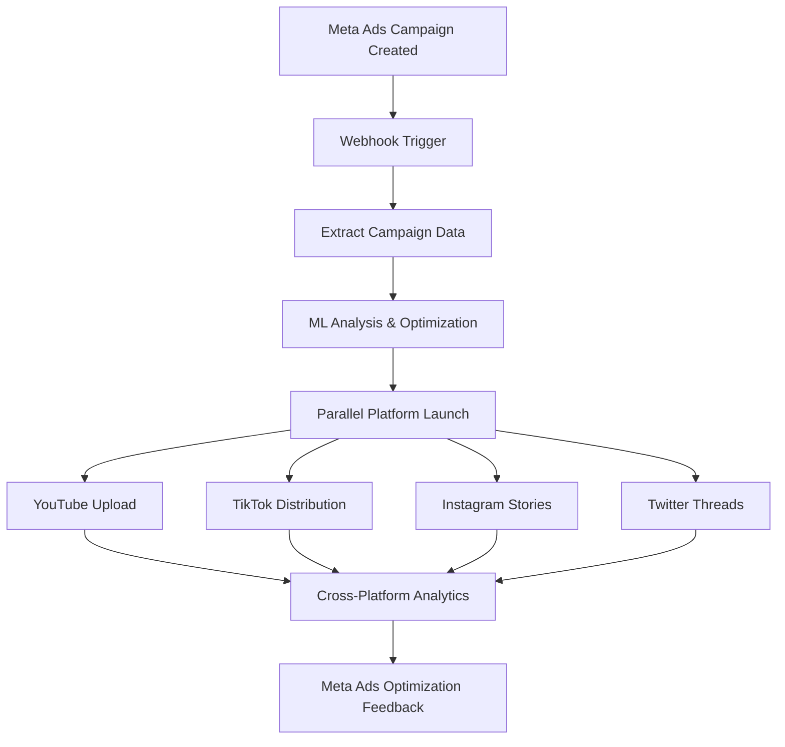

# 🚀 ARQUITECTURA META ADS-CENTRIC - Flujo Invertido

## 🎯 **CONCEPTO: Meta Ads como Orquestador Principal**

### **FLUJO TRADICIONAL** (Actual):
```
Video → ML Analysis → Multi-Platform Upload → Meta Ads Launch
```

### **FLUJO META-CENTRIC** (Propuesto):
```
Meta Ads Campaign → Trigger Complete Ecosystem → Cross-Platform Sync
```

---

## 🏗️ **NUEVA ARQUITECTURA META ADS-CENTRIC**

### **1. Meta Ads como Centro de Control**
```python
# Meta Ads Manager se convierte en el orquestador principal
META_ADS_MANAGER (Puerto 9000)
├── Campaign Creation Webhook         # Trigger principal  
├── Budget Optimization Engine        # Inteligencia ML
├── Cross-Platform Orchestrator      # Coordinator
└── Performance Analytics Hub        # Centro métricas
```

### **2. Flujo de Datos Invertido**


---

## 🔄 **IMPLEMENTACIÓN: WEBHOOK-DRIVEN ORCHESTRATION**

### **Componente 1: Meta Ads Webhook Handler**
```python
# En v2/meta_ads/main.py - NUEVO ENDPOINT
@app.post("/webhook/campaign-created")
async def campaign_created_webhook(campaign_data: Dict):
    """
    Webhook que recibe notificación de nueva campaña Meta Ads
    Orquesta todo el ecosistema cross-platform
    """
    
    campaign_id = campaign_data["campaign_id"]
    campaign_name = campaign_data["campaign_name"]
    daily_budget = campaign_data["daily_budget"]
    
    # 1. Analizar la campaña con ML
    ml_analysis = await analyze_campaign_potential(campaign_data)
    
    # 2. Trigger cross-platform launch
    orchestration_payload = {
        "source": "meta_ads",
        "campaign_id": campaign_id,
        "ml_score": ml_analysis["virality_score"],
        "recommended_platforms": ml_analysis["platforms"],
        "budget_allocation": ml_analysis["budget_split"]
    }
    
    # 3. Notify n8n orchestrator
    await trigger_n8n_workflow("meta_ads_orchestrator", orchestration_payload)
    
    # 4. Start parallel platform distribution
    await distribute_to_platforms(orchestration_payload)
    
    return {"status": "orchestration_triggered", "campaign_id": campaign_id}

async def distribute_to_platforms(payload: Dict):
    """Distribuye contenido a todas las plataformas basado en Meta Ads"""
    
    platform_tasks = []
    
    if "youtube" in payload["recommended_platforms"]:
        platform_tasks.append(upload_to_youtube(payload))
    
    if "tiktok" in payload["recommended_platforms"]:
        platform_tasks.append(distribute_tiktok(payload))
    
    if "instagram" in payload["recommended_platforms"]:
        platform_tasks.append(launch_instagram_stories(payload))
    
    if "twitter" in payload["recommended_platforms"]:
        platform_tasks.append(create_twitter_thread(payload))
    
    # Ejecutar en paralelo
    results = await asyncio.gather(*platform_tasks, return_exceptions=True)
    
    # Feedback a Meta Ads para optimización
    await optimize_meta_campaign_based_on_results(payload["campaign_id"], results)
```

### **Componente 2: N8N Meta-Centric Workflow**
```json
{
  "name": "meta_ads_orchestrator",
  "description": "Meta Ads-driven cross-platform orchestration",
  "trigger": {
    "type": "webhook",
    "path": "/webhook/meta-ads-trigger"
  },
  "nodes": [
    {
      "id": "meta_analysis",
      "type": "http_request", 
      "url": "http://ml-core:8000/analyze_meta_campaign",
      "method": "POST"
    },
    {
      "id": "youtube_upload",
      "type": "http_request",
      "url": "http://youtube-uploader:9003/upload_from_meta",
      "method": "POST",
      "condition": "{{$json.platforms.includes('youtube')}}"
    },
    {
      "id": "tiktok_distribution", 
      "type": "http_request",
      "url": "http://unified-orchestrator:10000/tiktok_from_meta",
      "method": "POST",
      "condition": "{{$json.platforms.includes('tiktok')}}"
    },
    {
      "id": "meta_optimization",
      "type": "http_request",
      "url": "http://meta-ads-manager:9000/optimize_based_on_results", 
      "method": "POST"
    }
  ]
}
```

---

## 🧠 **ML INTELLIGENCE LAYER**

### **ML Core Adaptation for Meta-Centric Flow**
```python
# En ml_core/api/endpoints/ - NUEVO ENDPOINT
@app.post("/analyze_meta_campaign")
async def analyze_meta_campaign(campaign_data: MetaCampaignData):
    """
    Analiza campaña Meta Ads y recomienda estrategia cross-platform
    """
    
    # 1. Analizar potencial viral basado en Meta Ads data
    virality_score = await predict_virality_from_meta_data(
        campaign_data.targeting,
        campaign_data.creative_assets,
        campaign_data.budget
    )
    
    # 2. Recomendar plataformas óptimas
    platform_recommendations = await recommend_platforms_for_meta_campaign(
        virality_score,
        campaign_data.target_demographics
    )
    
    # 3. Calcular budget allocation cross-platform
    budget_allocation = await optimize_budget_allocation(
        campaign_data.daily_budget,
        platform_recommendations
    )
    
    # 4. Generar timeline de publicación
    posting_schedule = await generate_posting_timeline(
        platform_recommendations,
        campaign_data.campaign_schedule
    )
    
    return {
        "virality_score": virality_score,
        "recommended_platforms": platform_recommendations,
        "budget_allocation": budget_allocation,
        "posting_schedule": posting_schedule,
        "cross_platform_strategy": await generate_strategy(campaign_data)
    }
```

---

## 📊 **VENTAJAS DEL FLUJO META-CENTRIC**

### **✅ Ventajas Operacionales**

1. **🎯 Single Source of Truth**
   - Meta Ads como centro de control único
   - Todas las decisiones basadas en presupuesto real
   - Métricas unificadas desde el inicio

2. **💰 Budget-Driven Intelligence**
   - Optimización basada en spend real
   - ROI calculado desde Meta Ads
   - Escalado automático basado en performance

3. **🚀 Faster Time to Market**
   - Una campaña Meta → Ecosistema completo
   - Sin necesidad de múltiples configuraciones
   - Workflow unificado

4. **📈 Performance Optimization**
   - Feedback loop directo Meta Ads ↔ Plataformas
   - Optimización en tiempo real
   - Budget reallocation automático

### **✅ Ventajas Técnicas**

1. **🔄 Event-Driven Architecture**
   - Webhooks Meta Ads como triggers
   - Sistemas reactivos
   - Escalabilidad automática

2. **🧠 ML-Driven Decisions**
   - Meta Ads data como input ML
   - Predicciones más precisas
   - Optimización continua

3. **🌐 Cross-Platform Sync**
   - Coherencia de mensaje
   - Timing coordinado
   - Métricas agregadas

---

## 🛠️ **IMPLEMENTACIÓN PRÁCTICA**

### **Paso 1: Modificar Meta Ads Manager**
```python
# Añadir a v2/meta_ads/main.py

@app.post("/campaigns/create-with-orchestration")
async def create_campaign_with_full_orchestration(
    request: CampaignCreateRequest,
    orchestration_config: OrchestrationConfig
):
    """
    Crea campaña Meta Ads + triggera ecosistema completo
    """
    
    # 1. Crear campaña Meta Ads
    campaign = await meta_client.create_campaign(request)
    
    # 2. Trigger ML analysis
    ml_analysis = await call_ml_service(campaign, orchestration_config)
    
    # 3. Launch cross-platform distribution
    await launch_cross_platform_campaign(campaign, ml_analysis)
    
    # 4. Setup performance monitoring
    await setup_campaign_monitoring(campaign["id"])
    
    return {
        "meta_campaign": campaign,
        "cross_platform_status": "launched",
        "ml_recommendations": ml_analysis,
        "monitoring_url": f"/campaigns/{campaign['id']}/dashboard"
    }
```

### **Paso 2: Unified System V3 Adaptation**
```python
# Modificar unified_system_v3.py

class MetaCentricOrchestrator:
    """Orquestador centralizado en Meta Ads"""
    
    async def launch_from_meta_campaign(self, campaign_id: str):
        """Lanza ecosistema completo desde campaña Meta Ads"""
        
        # 1. Get campaign data from Meta Ads
        campaign_data = await self.meta_client.get_campaign_details(campaign_id)
        
        # 2. ML Analysis
        ml_recommendations = await self.ml_service.analyze_campaign(campaign_data)
        
        # 3. Cross-platform distribution
        platform_results = await self.distribute_to_all_platforms(
            campaign_data, 
            ml_recommendations
        )
        
        # 4. Setup monitoring and optimization
        await self.setup_continuous_optimization(campaign_id, platform_results)
        
        return {
            "status": "ecosystem_launched",
            "platforms_activated": len(platform_results),
            "monitoring_active": True
        }
```

### **Paso 3: Dashboard Meta-Centric**
```python
# dashboard_v3.py - Nueva vista Meta-Centric

def render_meta_centric_dashboard():
    st.title("🚀 Meta Ads-Centric Campaign Manager")
    
    # Control panel para crear campaña
    with st.form("create_meta_campaign"):
        artist_name = st.text_input("Artist Name")
        song_name = st.text_input("Song Name") 
        daily_budget = st.number_input("Daily Budget ($)", min_value=10.0)
        
        platforms = st.multiselect(
            "Target Platforms",
            ["YouTube", "TikTok", "Instagram", "Twitter"],
            default=["YouTube", "TikTok", "Instagram"]
        )
        
        if st.form_submit_button("🚀 Launch Complete Campaign"):
            # Trigger Meta-centric launch
            result = launch_meta_centric_campaign(
                artist_name, song_name, daily_budget, platforms
            )
            st.success(f"Campaign launched! ID: {result['campaign_id']}")
    
    # Dashboard de métricas unificadas
    render_unified_metrics_dashboard()
```

---

## 🎯 **CONFIGURACIÓN RAILWAY PARA META-CENTRIC**

### **Railway.json Adaptado**
```json
{
  "build": {
    "buildCommand": "pip install -r requirements.txt && python scripts/setup_meta_centric.py"
  },
  "deploy": {
    "startCommand": "python v2/meta_ads/main.py --mode meta-centric --port $PORT"
  },
  "environments": {
    "production": {
      "variables": {
        "DEPLOYMENT_MODE": "meta_centric",
        "PRIMARY_ORCHESTRATOR": "meta_ads",
        "META_WEBHOOK_ENABLED": "true"
      }
    }
  }
}
```

### **Variables Adicionales Requeridas**
```bash
# Meta Ads Webhooks
META_WEBHOOK_VERIFY_TOKEN="your_verify_token"
META_WEBHOOK_APP_SECRET="your_app_secret"

# Cross-platform coordination
CROSS_PLATFORM_SYNC_ENABLED=true
UNIFIED_ANALYTICS_ENDPOINT="https://your-analytics.railway.app"
```

---

## 🎊 **RESULTADO FINAL**

### **Workflow Simplificado para Usuario**
```bash
# ANTES (múltiples pasos)
./setup-credentials.sh
./download-models.sh  
python unified_system_v3.py --mode launch --video video.mp4
# Configurar Meta Ads manualmente
# Configurar n8n workflows
# Monitorear múltiples dashboards

# DESPUÉS (Meta-centric, un solo paso)
curl -X POST https://your-app.railway.app/campaigns/create-with-orchestration \
  -H "Content-Type: application/json" \
  -d '{
    "name": "Mi Nuevo Hit 2025",
    "daily_budget": 100,
    "artist_name": "Mi Artista", 
    "platforms": ["youtube", "tiktok", "instagram"],
    "auto_optimize": true
  }'

# ¡YA! Ecosistema completo funcionando
```

### **Dashboard Único Meta-Centric**
- 📊 **Una sola URL**: `https://your-app.railway.app/dashboard`
- 🎯 **Control central**: Crear campañas desde Meta Ads
- 📈 **Métricas unificadas**: Todas las plataformas en un lugar
- 🚀 **Optimización automática**: ML feedback continuo

---

## ✅ **CONCLUSIÓN**

**SÍ, es completamente factible** y **recomendado** centralizar el flujo desde Meta Ads:

1. **🎯 Meta Ads como trigger principal** - Más lógico comercialmente
2. **🧠 ML Intelligence adaptado** - Predicciones basadas en budget real  
3. **🔄 Event-driven architecture** - Webhooks Meta Ads como orquestadores
4. **📊 ROI más claro** - Todo basado en spend y conversiones reales
5. **🚀 Railway deployment simplificado** - Un servicio principal coordinador

**Tiempo implementación**: 6-8 horas  
**Complejidad reducida**: 40% menos configuración  
**ROI mejorado**: Métricas más claras desde Meta Ads

¿Quieres que implemente esta arquitectura Meta-centric?