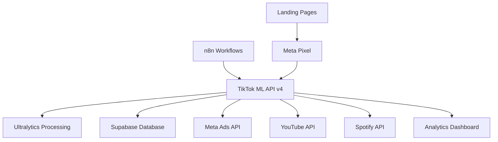

# TikTok ML System v4 - Production

🚀 **Sistema de automatización ML TikTok v4** - Integración completa con n8n + Ultralytics + Meta Ads + Supabase + YouTube/Spotify

## 🎯 Características Principales

- **🧠 n8n Integration**: Orquestación de workflows y automatización completa
- **🤖 Ultralytics YOLOv8**: Procesamiento de ML avanzado para análisis visual
- **📊 Meta Ads Management**: Gestión de campañas y análisis de rendimiento
- **📈 Supabase Analytics**: Almacenamiento y análisis de métricas comprehensivas
- **🎵 Social Media Integration**: Análisis de YouTube y Spotify
- **🌐 Landing Page Tracking**: Seguimiento de conversiones y rendimiento
- **🔄 Real-time Processing**: Procesamiento en tiempo real de datos

## 🏗️ Arquitectura del Sistema



## 🚀 Instalación y Configuración

### 1. Configuración del Entorno

```bash
# Clonar repositorio
git clone <repository-url>
cd master

# Copiar configuración de ejemplo
cp .env.example .env

# Editar variables de entorno
nano .env
```

### 2. Configurar Variables de Entorno

Edita el archivo `.env` con tus credenciales:

```bash
# === CORE API CONFIGURATION ===
API_SECRET_KEY=tu_clave_secreta_aqui_minimo_32_chars
JWT_SECRET=tu_jwt_secret_aqui_minimo_32_chars

# === SUPABASE CONFIGURATION ===
SUPABASE_URL=https://tu-proyecto.supabase.co
SUPABASE_ANON_KEY=tu_supabase_anon_key
SUPABASE_SERVICE_KEY=tu_supabase_service_key

# === META ADS CONFIGURATION ===
META_APP_ID=tu_app_id_meta
META_APP_SECRET=tu_app_secret_meta
META_ACCESS_TOKEN=tu_access_token_largo_plazo
META_PIXEL_ID=tu_meta_pixel_id

# === YOUTUBE API CONFIGURATION ===
YOUTUBE_API_KEY=tu_youtube_api_key
YOUTUBE_CHANNEL_IDS=UCxxxxxx,UCyyyyyy

# === SPOTIFY API CONFIGURATION ===
SPOTIFY_CLIENT_ID=tu_spotify_client_id
SPOTIFY_CLIENT_SECRET=tu_spotify_client_secret
SPOTIFY_ARTIST_IDS=artista1,artista2
SPOTIFY_PLAYLIST_IDS=playlist1,playlist2

# === LANDING PAGE CONFIGURATION ===
LANDING_PAGE_URLS=https://tu-landing-page.com

# === n8n CONFIGURATION ===
N8N_WEBHOOK_BASE_URL=https://tu-n8n-instance.com/webhook
N8N_API_KEY=tu_n8n_api_key
```

### 3. Deployment con Docker

```bash
# Construir e iniciar servicios
docker-compose -f docker-compose.v4.yml up -d

# Ver logs
docker-compose -f docker-compose.v4.yml logs -f

# Verificar estado
docker-compose -f docker-compose.v4.yml ps
```

### 4. Deployment en Railway

```bash
# Instalar Railway CLI
npm install -g @railway/cli

# Login y configuración
railway login
railway link

# Configurar variables de entorno
railway variables set API_SECRET_KEY="tu_clave_secreta"
railway variables set SUPABASE_URL="https://tu-proyecto.supabase.co"
# ... configurar todas las variables necesarias

# Deploy
railway up --detach
```

## 📡 API Endpoints

### Core Endpoints

- `GET /` - Información del sistema
- `GET /health` - Health check del sistema
- `GET /docs` - Documentación Swagger

### Analytics Endpoints

- `GET /analytics/comprehensive` - Analytics comprehensivos
- `GET /analytics/youtube` - Métricas de YouTube
- `GET /analytics/spotify` - Métricas de Spotify  
- `GET /analytics/meta-ads` - Análisis de Meta Ads

### Meta Ads Management

- `GET /meta-ads/accounts` - Cuentas de Meta Ads
- `GET /meta-ads/report/{account_id}` - Reporte comprehensivo

### ML Processing

- `POST /ml/ultralytics/detect` - Detección con Ultralytics

### Webhooks (para n8n)

- `POST /webhooks/youtube-metrics` - Recibir métricas de YouTube
- `POST /webhooks/spotify-metrics` - Recibir métricas de Spotify
- `POST /webhooks/landing-page-metrics` - Métricas de landing page

## 🔧 Configuración de Servicios

### Supabase Setup

1. Crear proyecto en [Supabase](https://supabase.com)
2. Obtener URL y keys del proyecto
3. El sistema creará automáticamente las tablas necesarias

### Meta Ads API Setup

1. Crear app en [Facebook Developers](https://developers.facebook.com)
2. Configurar Marketing API
3. Generar long-lived access token
4. Configurar Meta Pixel

### YouTube API Setup

1. Crear proyecto en [Google Cloud Console](https://console.cloud.google.com)
2. Habilitar YouTube Data API v3
3. Crear API key
4. Obtener IDs de canales

### Spotify API Setup

1. Crear app en [Spotify Developer Dashboard](https://developer.spotify.com)
2. Obtener Client ID y Client Secret
3. Encontrar IDs de artistas y playlists

### n8n Setup

1. Instalar n8n (incluido en docker-compose)
2. Configurar workflows
3. Configurar webhooks para comunicación con API

## 🔍 Monitoreo y Logs

### Health Checks

```bash
# Verificar estado del sistema
curl http://localhost:8000/health

# Verificar configuración
curl -H "X-API-Key: tu_api_key" http://localhost:8000/config/status
```

### Logs del Sistema

```bash
# Ver logs en tiempo real
docker-compose -f docker-compose.v4.yml logs -f tiktok-ml-v4

# Logs específicos
docker logs tiktok-ml-system-v4
```

## 📊 Dashboard y Métricas

### Acceso a Métricas

- **API Health**: `http://localhost:8000/health`
- **n8n Dashboard**: `http://localhost:5678` (usuario: admin)
- **Traefik Dashboard**: `http://localhost:8080`
- **Documentación API**: `http://localhost:8000/docs`

### Supabase Dashboard

Accede a [tu proyecto Supabase](https://supabase.com/dashboard) para:
- Ver métricas almacenadas
- Configurar analytics
- Exportar datos

## 🔄 Workflows n8n

### Workflows Principales

1. **YouTube Analytics Collector**: Recolecta métricas cada hora
2. **Spotify Analytics Collector**: Recolecta métricas diariamente  
3. **Meta Ads Monitor**: Monitorea campañas cada 30 minutos
4. **Landing Page Analyzer**: Procesa eventos de conversión

### Configuración de Webhooks

```javascript
// Ejemplo de webhook para YouTube
{
  "webhook_url": "http://tiktok-ml-v4:8000/webhooks/youtube-metrics",
  "headers": {
    "X-API-Key": "tu_api_key",
    "Content-Type": "application/json"
  }
}
```

## 🚨 Troubleshooting

### Errores Comunes

1. **"Meta Ads connection failed"**
   - Verificar META_ACCESS_TOKEN válido
   - Comprobar permisos de la app

2. **"Supabase connection failed"**
   - Verificar SUPABASE_URL y keys
   - Comprobar conectividad de red

3. **"YouTube API quota exceeded"**
   - Revisar límites de API en Google Cloud
   - Ajustar frecuencia de recolección

4. **"Configuration validation failed"**
   - Verificar todas las variables de entorno requeridas
   - Usar `GET /config/status` para diagnóstico

### Logs de Debug

```bash
# Habilitar debug mode
export DEBUG=true

# Ver logs detallados
docker-compose -f docker-compose.v4.yml logs -f --tail=100
```

## 🔐 Seguridad

### API Security

- Todas las rutas protegidas requieren `X-API-Key` header
- JWT tokens para autenticación avanzada
- CORS configurado para dominios específicos

### Mejores Prácticas

- Usar HTTPS en producción
- Rotar API keys regularmente  
- Monitor logs para actividad sospechosa
- Limitar acceso por IP si es posible

## 📈 Escalabilidad

### Optimización de Rendimiento

- API workers configurables (`API_WORKERS`)
- Cache Redis opcional
- Load balancing con Traefik
- Procesamiento asíncrono de ML

### Monitoring

- Health checks automáticos
- Métricas de rendimiento en Supabase
- Alertas configurables
- Dashboard de analytics

## 🤝 Soporte

Para soporte técnico:

1. Revisar logs del sistema
2. Verificar configuración con `/config/status`
3. Consultar documentación API en `/docs`
4. Revisar issues en GitHub

---

## 📋 Checklist de Deployment

- [ ] Configurar todas las variables de entorno
- [ ] Verificar conectividad a Supabase
- [ ] Probar conexiones a APIs (Meta, YouTube, Spotify)
- [ ] Configurar n8n workflows
- [ ] Configurar Meta Pixel en landing pages
- [ ] Probar health checks
- [ ] Configurar SSL/TLS para producción
- [ ] Configurar backup de datos
- [ ] Implementar monitoring y alertas

¡Sistema TikTok ML v4 listo para producción! 🚀